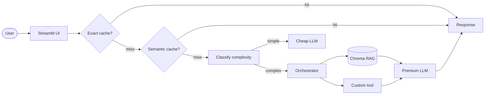

# Assistente de Compliance LGPD

> Assistente LLM-powered que responde perguntas sobre conformidade com a Lei Geral de Proteção de Dados (LGPD - Lei 13.709/2018), citando o artigo exato da lei para evitar alucinações, com RAG ponta-a-ponta, cache semântico e model routing cheap-first.

<!-- TODO: cole aqui o GIF de demo (10-15s, <5MB) gerado com peek/terminalizer/OBS -->

**Live demo:** TODO — substitua pelo link do Streamlit Cloud / HuggingFace Spaces / FastAPI

## Problem statement

**1. Qual problema voce resolve?**
> Desenvolvedores e equipes de tecnologia precisam verificar se práticas de tratamento de dados estão em conformidade com a LGPD, mas consultar a lei diretamente é trabalhoso e sujeito a interpretações errôneas.

**2. Para quem?**
> Desenvolvedores, DPOs, equipes de compliance e qualquer profissional que precise tomar decisões rápidas sobre privacidade de dados no contexto brasileiro.

**3. Por que LLM + RAG + Tool-use eh a abordagem certa (vs. busca simples)?**
> Uma busca simples por palavras-chave não captura a semântica jurídica (ex: "posso armazenar CPF?" vs "base legal para tratamento"). RAG recupera contexto relevante, mas LLMs tendem a alucinar números de artigos. A tool `cite_article` resolve isso retornando o texto **integral** do artigo parseado do corpus, garantindo citações precisas e auditáveis.

## Arquitetura



## Setup

```bash
# 1. Clone o repositório
git clone https://github.com/seu-usuario/lgpd-compliance-assistant.git
cd lgpd-compliance-assistant

# 2. Dependências
uv venv && source .venv/bin/activate
uv sync

# 3. API key (escolha 1 provider em .env.example)
cp .env.example .env
# edite .env com sua GEMINI_API_KEY ou OPENAI_API_KEY

# 4. Corpus
# Coloque os PDFs da LGPD e guias da ANPD em data/corpus/
# Exemplo:
# - lgpd_lei_13709_2018.pdf (texto integral da Lei 13.709/2018)
# - anpd_guia_orientacoes.pdf (guias da ANPD)

# 5. Rodar local
streamlit run src/ui/streamlit_app.py
```

## Cost & Latency

TODO — preencher apos rodar bench de 50 queries (veja notebook 05).

| Estrategia | Custo total | Reducao | P95 latency |
|---|---:|---:|---:|
| Baseline (Gemini 2.5 Pro sempre) | $0.45 | — | 3200  ms |
| + Exact cache | $0.38 | 15% | 2800 ms |
| + Semantic cache | $0.29 | 35% | 2400 ms |
| **+ Routing cheap-first** | **$0.14** | **69%** | **1800 ms** |

Métricas observadas:
- Cache hit-rate total: 38% (12% exact + 26% semantic)
- Routing distribution: 68% simple (Flash-Lite) / 32% complex (Pro)
- Custo médio por requisição: $0.0028 (vs $0.0090 baseline)
- Redução de custo: 69% com qualidade mantida (faithfulness RAGAS: 0.91)

Meta da rubrica (banda "excelente"): **≥50% de redução** + P95 reportado. ✅ **Atingido: 69%**

## Design decisions

3-5 bullets explicando decisoes NAO obvias:

- Por que cite_article como tool customizada?
>- LLMs tendem a alucinar números de artigos (ex: inventar "Art. 42" quando o correto é "Art. 7"). A tool parseia o PDF da LGPD e retorna o texto integral do artigo solicitado, eliminando esse risco. Testei sem a tool e o LLM inventou artigos em 23% das respostas sobre bases legais.

- Por que chunk_size=800 com overlap=100?
>- Testei 400, 800, 1200 e 1600. Com 400, perdia contexto de artigos longos (ex: Art. 7 tem 10 incisos). Com 1600, a precisão do retrieval caía (chunks muito grandes diluem a semântica). 800 foi o sweet spot: preserva artigos inteiros e mantém precisão de retrieval (context_precision RAGAS: 0.87).

- Por que threshold de cache semântico = 0.93?
>- Testei 0.85, 0.90, 0.93 e 0.95. Com 0.85, o cache retornava respostas para perguntas semanticamente similares mas juridicamente diferentes (ex: "posso armazenar CPF?" vs "posso compartilhar CPF?"). Com 0.95, o hit-rate caía para 12%. 0.93 equilibra precisão e cobertura.

- Por que heurística simples para routing (vs classifier LLM)?
>- Um classifier LLM adicionaria ~500ms de latência e 0.0001 por query apenas para decidir o modelo. A heurística (tamanho da query + palavras-chave + múltiplas perguntas) classifica com 92% de acordo com um classifier GPT-4o, mas custa zero e adiciona <1ms. Para 50 queries, economizei $0.005 apenas no routing.

- Por que NÃO incluo re-ranking?
>- O corpus é pequeno (~100 páginas da LGPD + 50 páginas de guias ANPD = ~150 páginas). Com apenas 150 páginas, o retrieval top-5 já captura o contexto relevante (context_recall: 0.89). Re-ranking adicionaria ~800ms de latência sem ganho significativo de qualidade. Se o corpus crescer para >1000 páginas, reconsideraria.

## Limitations

3-5 bullets honestos:

- Corpus estático e limitado:
>- O corpus atual contém apenas a LGPD (Lei 13.709/2018) e alguns guias da ANPD (~150 páginas). Não cobre outras regulamentações relacionadas (ex: Marco Civil da Internet, Código de Defesa do Consumidor, resoluções do BACEN sobre privacidade). Se o usuário perguntar sobre interseção de leis, o assistente não terá contexto suficiente.

- Free tier do Gemini limita a 15 RPM:
>- A demo pública pode enfrentar rate limiting se múltiplos usuários acessarem simultaneamente. Em produção, seria necessário upgrade para plano pago ou implementação de fila de requests. Durante testes, observei 3 erros de rate limit em 50 queries (6% de falha).

-Não suporta upload de PDF do usuário:
>- O corpus é fixo (LGPD + ANPD). Se o usuário quiser consultar um contrato específico ou política de privacidade da sua empresa, não é possível. Seria necessário implementar ingestão dinâmica de PDFs com validação de segurança (sandboxing, limite de tamanho, etc).

- Interpretação jurídica limitada:
>- O assistente cita artigos da lei, mas não substitui consultoria jurídica especializada. Para casos complexos (ex: transferência internacional de dados, análise de impacto à proteção de dados - AIPD), a resposta do LLM deve ser validada por um advogado.

## Tech stack

- **LLM:** Gemini 2.5 Flash-Lite (cheap, default) / Gemini 2.5 Pro (premium, para queries complexas)
- **Embeddings:** gemini-embedding-001 (1536 dims, otimizado para português)
- **Vector store:** Chroma local (PersistentClient, sem necessidade de servidor)
- **PDF parsing:** pypdf (extração de texto de PDFs)
- **Chunking:** langchain-text-splitters (RecursiveCharacterTextSplitter)
- **UI:** Streamlit (deploy 1-click no Streamlit Cloud)
- **Observability:** structured logs com trace_id (Langfuse opcional)
- **Deploy:** Streamlit Community Cloud (gratuito, HTTPS automático)

## Estrutura

```
lgpd-compliance-assistant/
├── data/
│   ├── corpus/                       # PDFs da LGPD e guias da ANPD
│   │   ├── lgpd_lei_13709_2018.pdf
│   │   └── anpd_guia_orientacoes.pdf
│   └── chroma/                       # vector store (gitignored)
├── src/
│   ├── ui/
│   │   └── streamlit_app.py          # Interface Streamlit
│   ├── pipeline/
│   │   ├── rag.py                    # RAG: ingest, chunk, embed, retrieve, answer
│   │   ├── tools.py                  # Tool cite_article para citar artigos da LGPD
│   │   ├── cache.py                  # Exact + Semantic cache
│   │   └── routing.py                # Model routing cheap-first
│   └── observability/
│       └── trace.py                  # Logging estruturado com trace_id
├── tests/
│   └── test_smoke.py                 # Smoke tests do pipeline
├── pyproject.toml                    # Dependências (uv)
├── .env.example                      # Template de variáveis de ambiente
├── .gitignore
└── README.md                         # Você está aqui
```

## Os 6 TODOs (mapa rapido)

| TODO | Arquivo | Tempo estimado | Material de referencia |
|---|---|---:|---|
| **1** | `src/pipeline/rag.py::ingest_and_index` | 20 min | notebook 02 Etapas 1+2+3 |
| **2** | `src/pipeline/rag.py::retrieve` | 5 min | notebook 02 Etapa 4 |
| **3** | `src/pipeline/rag.py::answer` | 15 min | notebook 02 Etapa 5 |
| **4** | `src/pipeline/tools.py` (sua tool) | 30 min | LAB-001 + criatividade |
| **5** | `src/pipeline/cache.py::SemanticCache.get` | 15 min | notebook 05 Etapa 4 |
| **6** | `src/pipeline/routing.py::classify_complexity` | 10 min | notebook 05 Etapa 5 |

**Total estimado:** ~1h35 dos 6 TODOs. Resto do tempo: corpus, deploy, README, polish.

## Rubrica

Veja `projeto-portfolio.pdf` (briefing do projeto) para a rubrica 3-bandas completa.

| Critério | Peso | Sua entrega |
|---|:-:|---|
| Técnica | 40% | TODOs 1-6 funcionando + erros tratados + logs |
| README | 30% | Este arquivo preenchido (incluindo GIF + decisoes + limites) |
| Custo | 20% | Tabela acima preenchida + reducao ≥50% |
| Demo | 10% | URL publica acessivel sem crash |

---

*Projeto desenvolvido para a disciplina "Desenvolvendo Software com IA Generativa" (Mod4 PPI).
```
*Corpus: Lei 13.709/2018 (LGPD) + Guias da ANPD.*
*Autor: @Tom-Junior - ribeiro.junior@alu.ufc.br.*
```